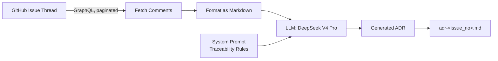

<h1 align="center">Hekmo (ܚܟܡܬܐ / חָכְמָה / حكمة)</h1>
<p align="center"><em>Syriac for "wisdom" (ḥekmtā) sharing its root with Hebrew (chokmah) and Arabic (hikma).</em></p>

<p align="center">
  <a href="https://pypi.org/project/hekmo/"></a>
  <a href="https://pypi.org/project/hekmo/"></a>
  <a href="https://github.com/Sherwin-14/Hekmo/blob/main/LICENSE"></a>
  <a href="https://github.com/Sherwin-14/Hekmo/actions/workflows/ci.yml"></a>
</p>

**Lightning fast ADR drafting for busy teams.**

This tool takes a GitHub issue thread with arguments, the back-and-forth, the eventual consensus and distills it into a clean Architecture Decision Record (ADR), so the reasoning behind a decision doesn't get lost in a comment thread nobody wants to re-read.

----

### Example


----

### Requirements

- Python 3.12+
- A GitHub PAT (personal access token)
- A DeepSeek API key

----

### Quick start

```bash
pip install hekmo
```

Set two environment variables (see [Configuration](#configuration)):

```bash
export GITHUB_PERSONAL_ACCESS_TOKEN=ghp_xxxxxxxxxxxx
export DEEPSEEK_API_KEY=sk-xxxxxxxxxxxx
```

Then run:

```bash
hekmo
```

----

### Configuration

`hekmo` needs two credentials, set as environment variables:

| Variable | Purpose 
|---|---|
| `GITHUB_PERSONAL_ACCESS_TOKEN` | Reads issue/comment data via the GitHub GraphQL API
| `DEEPSEEK_API_KEY` | Powers ADR generation 

----

### Templates

`hekmo` supports multiple ADR formats out of the box, selectable at runtime:

- **default** — a comprehensive general-purpose format.
- **Nygard** — the original, lightweight ADR format.
- **MADR** — Markdown Architecture Decision Records, with explicit decision drivers and pros/cons of considered options.
- **Alexandrian** — a narrative-style format.
- **Tyree-Akerman** — a detailed format capturing assumptions, constraints, positions, and related artifacts
- **Y-Statement** — a compact, single-paragraph decision format.

*(see `hekmo/utils/templates.json` for the full section breakdown of each format)*

----

### Best Practices and Architecture



#### Garbage in, garbage out

`hekmo` extracts and structures what's actually written in a thread it doesn't infer intent that isn't there. The quality of the ADR is a direct function of the quality of the discussion:

- Threads with a clear proposal, real pushback, and a stated resolution produce strong ADRs.
- Threads that are mostly status updates, "+1"s, or tangents give the model little to work with the output will be thin or generic.
- If you're planning to generate an ADR from an issue, state the final decision and reasoning explicitly in a closing comment, rather than leaving the conclusion implied.

#### Traceability by design

`hekmo`'s system prompt is built around one rule: every sentence in the generated ADR should be traceable back to something actually said in the thread. This is deliberate  it keeps output trustworthy rather than a plausible-sounding hallucination, at the cost of not papering over a genuinely thin discussion with invented rationale.

#### Model support

`hekmo` currently uses **DeepSeek V4 Pro** exclusively for ADR generation. Your `DEEPSEEK_API_KEY` must have access to this model other DeepSeek models and other providers are not yet supported. As with any LLM-backed tool, `hekmo` is subject to the context window limits of the underlying model currently.

#### Where your ADR is saved

`hekmo` saves the generated ADR as `adr-<issue_number>.md` in the directory you're currently in when you run the command. It does not clone or touch any local git repo it only talks to GitHub's API.

If a file with that name already exists in your current directory, it will be silently overwritten. Run `hekmo` from a directory dedicated to your ADRs (or move the generated file immediately) if you want to avoid this.

If you're adopting this on a team, highest-leverage improvement today is raising the quality of the input itself:

- Better threads produce more factually grounded ADRs with less hallucination.
- Better threads mean less manual cleanup on *every* ADR, not just one.
- Encourage contributors to write detailed, decision-oriented comments, and treat thread quality as part of the process, not an afterthought.

**The ADR is only ever as good as the conversation that produced it.**

----

### Motivation

Most engineering decisions don't happen in a design doc. They happen in a GitHub issue: someone proposes something, three people push back, someone finds a tradeoff nobody considered, and twenty comments later there's a decision buried in a thread that will never be read again.

This isn't just anecdotal. A 2023 mining-software-repositories study of ADR usage across open-source GitHub projects ([Buchgeher et al., IEEE Access](https://ieeexplore.ieee.org/document/10155430)) found that ADR adoption remains low overall, and that roughly half of repositories that do adopt the practice contain only one to five ADRs total, a pattern the authors read as teams trying ADRs and then not sustaining them. The study also found that where ADRs do stick, it's a deliberate, sustained team effort over time, not a one-off habit.

Separately, an exploratory study on LLM-generated ADRs ([Dhar et al.](https://arxiv.org/html/2403.01709v1), 2024) found that even the strongest models (GPT-4) can produce design decisions in the correct ADR format, but consistently fall short of comprehensively capturing the decision meaning LLMs are a genuinely useful drafting aid, not an autonomous replacement for human judgment. That study also worked from pre-cleaned, single-paragraph decision context, not the messier reality of a live 50-comment GitHub thread the harder, noisier input hekmo is actually built to handle.  Follow-up work by the same group ([Dhar et al.](https://arxiv.org/abs/2504.08207), 2025) addressed this gap with retrieval-augmented fine-tuning, and a more recent study ([Context Matters](https://arxiv.org/html/2604.03826v1), 2026) showed that providing a project's prior architectural decisions as context substantially improves generation quality.

***Conclusion***: the practice of writing ADRs is dying from friction, not from lack of value, and LLMs can meaningfully lower that friction but only as a first draft a human reviews, not a replacement for their judgment. hekmo is built around both of these findings: it exists to make drafting cheap enough that it actually happens, and its "traceability by design" system prompt (see Best Practices and Architecture) is a direct response to the second finding every sentence must trace back to the thread, specifically so the output is a reviewable draft rather than a plausible-sounding hallucination.


----

### License

Eclipse Public License - 2.0

## Code of Conduct

See [CODE_OF_CONDUCT.md](CODE_OF_CONDUCT.md).
